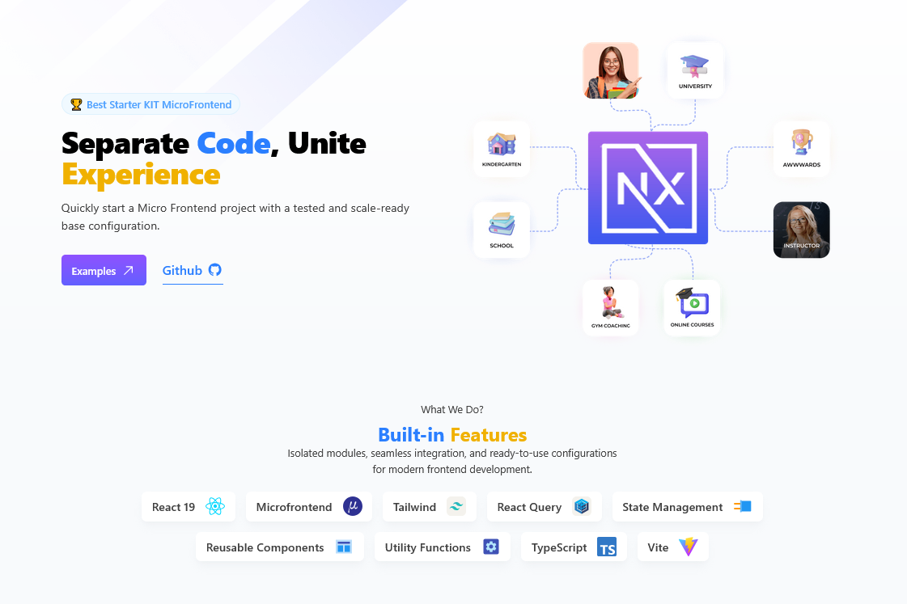

<p align="center">
  
</p>

# NexaFE - Starter Kit

NexaFE is a modern starter kit for building modular frontends with React, TailwindCSS, and Microfrontend architecture.

This kit provides a ready-to-use structure for a variety of standalone microfrontend applications that can be navigated through the Microfrontend Host.

---

## Features & Technologies

- React 19
- Microfrontend Host
- TailwindCSS
- React Query
- State Management
- Reusable Components
- Utility Functions
- TypeScript
- Vite

---

## Run Locally

```bash
pnpm install
pnpm dev
```

---

## Struktur Folder

```
nexa-fe/
│
├── public/assets/images/
│   └── logo.png
│
├── src/
│   ├── app/
│   │   ├── App.tsx
│   │   ├── main.tsx
│   │   ├── routes.tsx
│   │   └── providers.tsx
│   │
│   ├── data/
│   │   ├── Api.ts
│   │   ├── product/
│   │   │   ├── productService.ts
│   │   │   ├── productTypes.ts
│   │   │   └── productUse.ts
│   │   └── user/
│   │       ├── userService.ts
│   │       ├── userTypes.ts
│   │       └── userUse.ts
│   │
│   ├── infra/
│   │   ├── app1
│   │   │   └── App.tsx
│   │   ├── app2
│   │   │   ├── App.tsx
│   │   │   ├── types.ts
│   │   │   └── useTodos.ts
│   │   └ Host.tsx
│   │
│   ├── ix/
│   │   └── stores
│   │       ├── ThemeProvider.tsx
│   │       └── useTheme.tsx
│   │
│   ├── ui/
│   │   ├── components/
│   │   │   ├── Page.tsx
│   │   │   ├── Header.tsx
│   │   │   ├── Footer.tsx
│   │   │   ├── Card.tsx
│   │   │   ├── Button.tsx
│   │   │   ├── Input.tsx
│   │   │   └── Modal.tsx
│   │   ├── layouts/
│   │   │   └── MainLayout.tsx
│   │   ├── pages/ 
│   │   │   └── Host.tsx
│   │   ├── styles/ 
│   │   │   └── tailwind.css
│   │   └── tokens/
│   │       ├── colors.ts
│   │       ├── spacing.ts
│   │       └── typography.ts
│   │
│   └── utils/
│       └── formatDate.ts
│
├── index.html
├── package.json
├── postcss.config.mjs
├── Dockerfile
├── docker-compose.yml
└── tsconfig.json
````